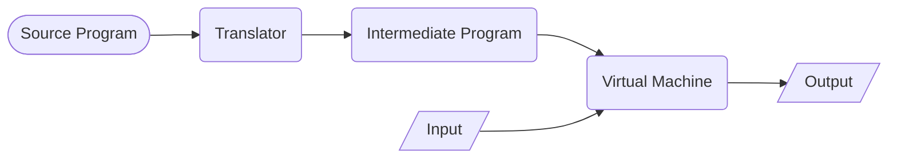
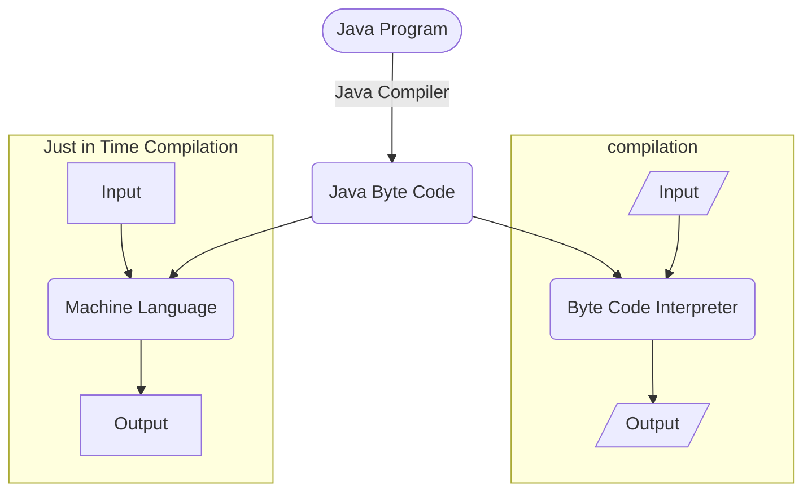

### Compilers

#### Lexical Analysis vs Syntax Analysis
- **Lexical Analysis:** Converts the source code into tokens.
- **Syntax Analysis:** Converts the tokens into a parse tree.

#### compilation + interpretation

#### Linking
- **Static Linking:** The linking is done at compile time.
- **Dynamic Linking:** The linking is done at runtime.

Above diagram shows a dynamic linking process.

#### Cross Compilation or transpilation
- **Cross Compilation:** The source code is compiled on one machine and the object code is run on another machine.

- **Transpilation:** The source code is converted from one language to another language.

#### Bootstrapping
- **Bootstrapping:** The process of writing a compiler in the language that it compiles. Which is called self-hosting.
- How It's done? Initially, a compiler is written in another language. Then the compiler is compiled using the existing compiler. The new compiler is then used to compile itself.

#### Just in Time Compilation (JIT)
- **Just in Time Compilation:** The source code is compiled at runtime. It is used in virtual machines like Java, .NET, etc.

