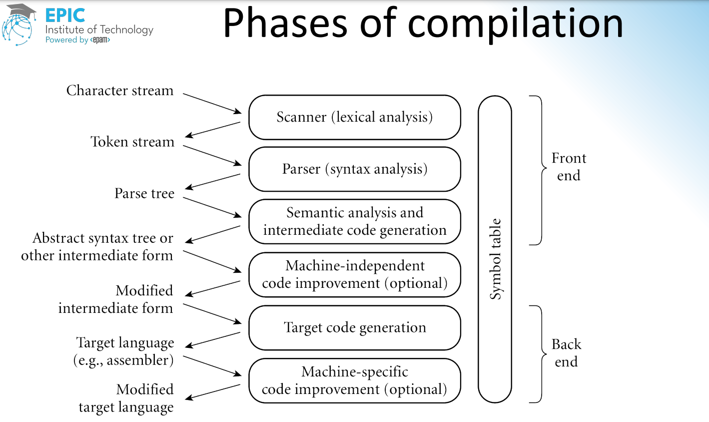

### Compilers


#### Lexical Analysis vs Syntax Analysis
- **Lexical Analysis:** Converts the source code into tokens.
- **Syntax Analysis:** Converts the tokens into a parse tree.

#### compiler + interpreter
```mermaid
graph TD;
    A[Source Code] --> B[Compiler];
    B --> C[Machine Code];
    A --> D[Interpreter];
    D --> E[Machine Code];
