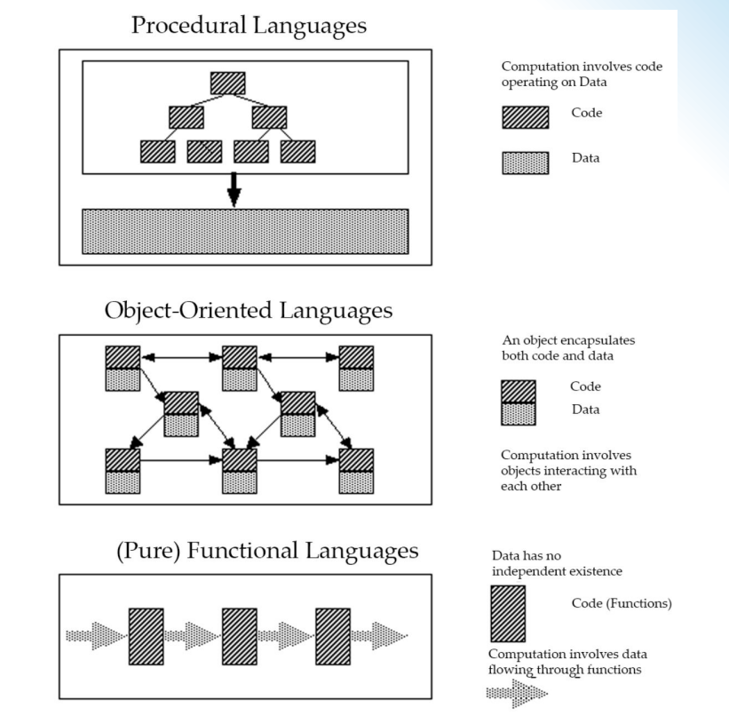

1. Types of programming
    - Imperative Programming
    - object-oriented programming
    - Concurrent Programming
    - Event-Driven Programming
    - Functional Programming
    - Scripting
    - constraint-based programming

2. Imperative Programming
    - The programmer tells the computer what to do by giving it a sequence of commands to perform. The computer performs the commands in the order they are given.
    - Key concepts:
        - variables
        - commands
        - procedures
        - data abstraction (recent addition)
3. Object-Oriented Programming
    - The programmer defines objects that interact with each other to solve a problem. Objects have attributes and methods that define their behavior.
    - Key concepts:
        - objects
        - classes and subclasses
        - inheritance
        - polymorphism
        
3. Concurrent Programming
    - The programmer writes programs that run multiple tasks at the same time. This can be done by using multiple threads or processes.
    - Key concepts:
        - threads
        - processes
        - synchronization
        - communication
        - mutual exclusion
            - Deadlock, livelock, and starvation
        - concurrent control abstractions (recent addition support reliability)

4. Event-Driven Programming
    - The programmer writes programs that respond to events. Events can be user actions, such as clicking a button, or system events, such as a timer expiring.
    - Key concepts:
        - events
        - event listeners

5. Functional Programming
    - The model of computation is the application of functions to arguments.
    - key concepts
        - Expressions
        - Functions
        - parametric polymorphism
        - data abstraction
        - lazy evaluation

